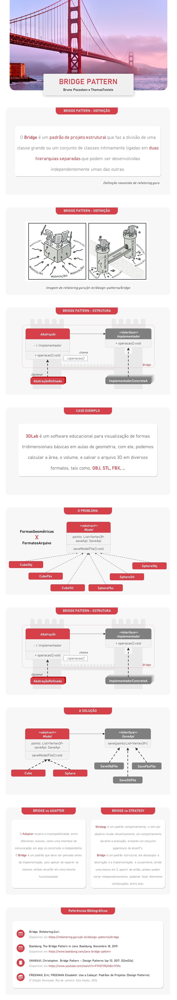

# Bridge Pattern
Uma breve apresentação de um dos padrões de projeto da família dos clássicos padrões estruturais do **Gang Of Four**

## Explicação 🎞
[Video](https://youtu.be/Bo9O0V8s1Lw)

## Instalação 💻
Apenas o java é necessário
```cmd 
git clone https://github.com/brunopozzebon/bridge-pattern.git
```

